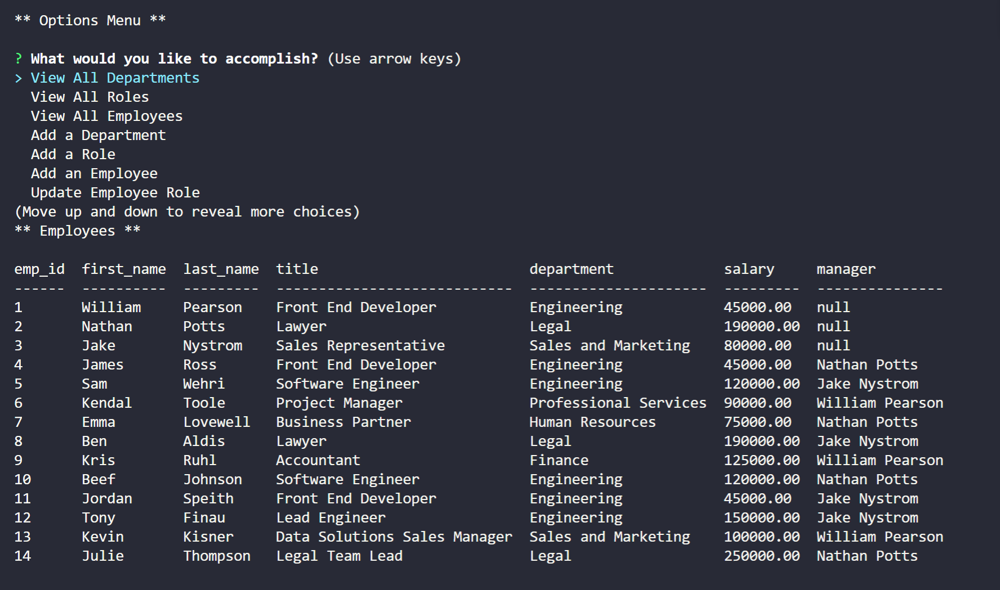

# Note Taker Application

## Description

Developers are often tasked with creating interfaces that make it easy for non-developers to view and interact with information stored in databases. These interfaces are known as Content Management Systems (CMS).

This application allows the end user to modify an employee tracking database. They will be able to view all of the tables in the database through the use of a CLI. In addition to viewing, the end user will be able to add roles, departmetns and employees to the database.

### Table of Contents

- [Usage](#user)
- [Acceptance](#acceptance)
- [NPM](#npm)
- [Contributing](#contributing)
- [Questions](#questions)
- [About](#about)
- [Screenshot](#screenshot)

## User Story

```md
AS A business owner
I WANT to be able to view and manage the departments, roles, and employees in my company
SO THAT I can organize and plan my business
```

## Acceptance Criteria

```md
GIVEN a command-line application that accepts user input
WHEN I start the application
THEN I am presented with the following options: view all departments, view all roles, view all employees, add a department, add a role, add an employee, and update an employee role
WHEN I choose to view all departments
THEN I am presented with a formatted table showing department names and department ids
WHEN I choose to view all roles
THEN I am presented with the job title, role id, the department that role belongs to, and the salary for that role
WHEN I choose to view all employees
THEN I am presented with a formatted table showing employee data, including employee ids, first names, last names, job titles, departments, salaries, and managers that the employees report to
WHEN I choose to add a department
THEN I am prompted to enter the name of the department and that department is added to the database
WHEN I choose to add a role
THEN I am prompted to enter the name, salary, and department for the role and that role is added to the database
WHEN I choose to add an employee
THEN I am prompted to enter the employee’s first name, last name, role, and manager and that employee is added to the database
WHEN I choose to update an employee role
THEN I am prompted to select an employee to update and their new role and this information is updated in the database 
```

## NPM Packages/Technical

- inquirer https://www.npmjs.com/package/inquirer
- console.table https://www.npmjs.com/package/console.table
- mysql2 https://www.npmjs.com/package/mysql2

- JavaScript
- Node.js

## Contributing

Jullian Gillis

## Questions

Thanks for looking at my Note Taker Applicaion, my name is Jake Nystrom! If you would like to reach me, feel free to write to jwm.nystrom@gmail.com. I will look forward to hearing from you!

## About the Author

Today, as a motivated and goal oriented individual I embrace challenges, strive to help others learn and develop, work collaboratively with teams, and push myself to further develop my current skill set with an expectation to succeed. I thrive in high paced environments where teams are setup for success.

## Screenshot


